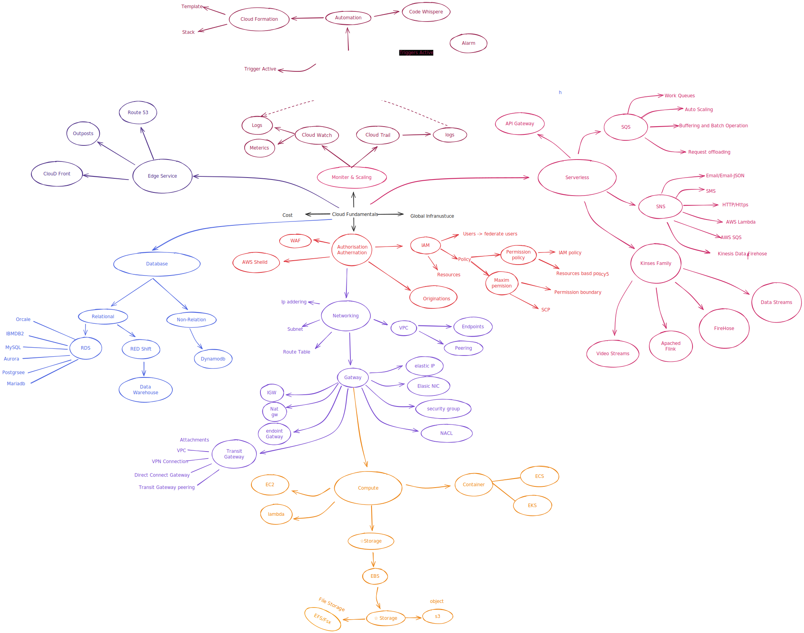
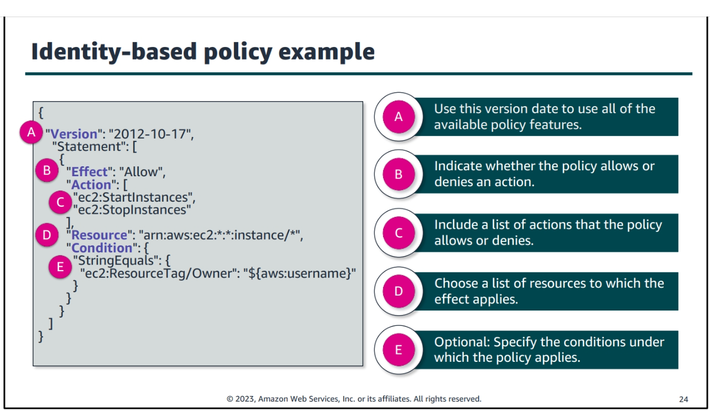
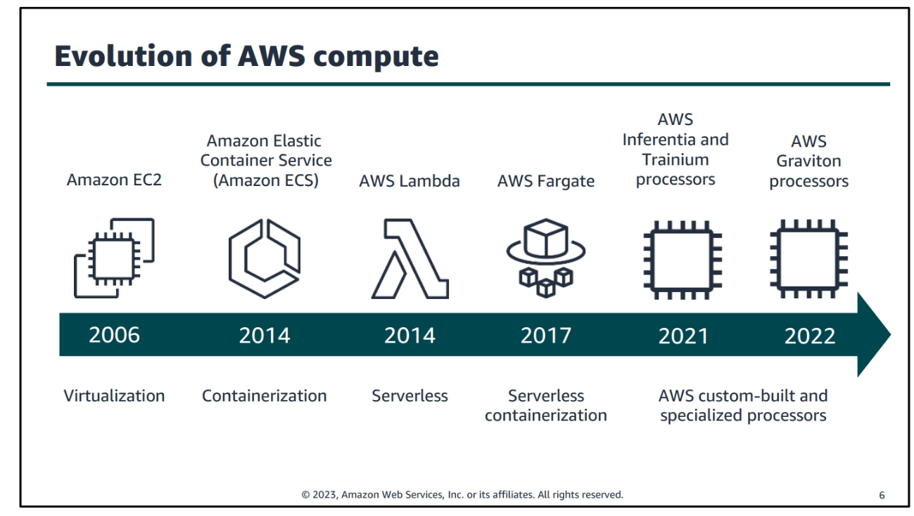
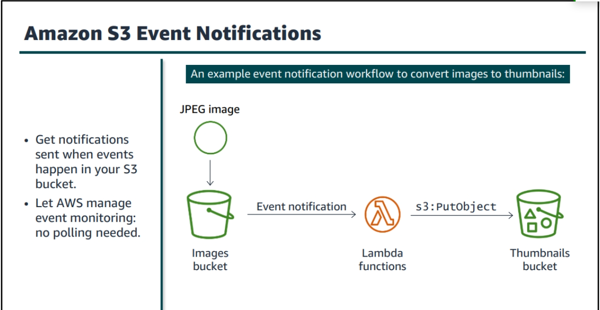
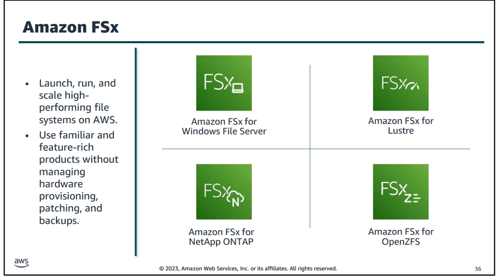
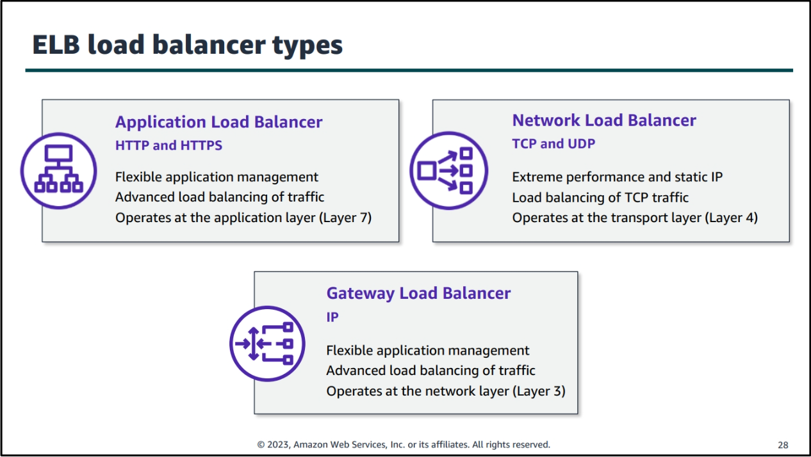

# Day 1: AWS Security and Identity Management

## Create Role

### Trust Policy: 
The trust policy defines who or what can assume the role. It outlines the entities that are allowed to take on the permissions associated with the role. This can include AWS services, users, accounts, or even external identities

### Permissions Policy: 
The permissions policy specifies what actions and resources the role is allowed to access or manipulate. It defines the boundaries of the role's capabilities within AWS. Permissions policies can be crafted to be very granular, allowing for fine-tuned control over the role's actions.

## Policy Types

### 1. Grant Permissions:
This policy type involves explicitly granting specific permissions to roles, users, or groups. It provides a detailed and controlled approach to defining who can do what within an AWS environment.

### 2. AWS Boundaries:
AWS boundaries refer to limitations set on resources or actions within the AWS infrastructure. These boundaries are often defined by AWS itself to ensure the security and stability of the overall system.

## Organizations

### 1. Internet Root User and SCP (Service Control Policies) Only Organization:
This type of organization restricts the root user to only have access to Service Control Policies, providing a highly secure and controlled environment.

### 2. OU (Organizational Unit) Groups of Accounts:
Organizational Units allow for the grouping of AWS accounts based on specific criteria. Within an OU, accounts can be further categorized. For example:
- Root
  - Sandbox
  - Security
  - Test

Organizational Units help in structuring and organizing AWS accounts effectively.

### How Organizations Work:
AWS Organizations enable the management of multiple AWS accounts. It allows for central management of policies, consolidated billing, and simplified resource sharing between accounts.

## Types of Identity-Based Policies

### 1. AWS Managed Policies:
   - Service Access: These policies grant permissions for specific AWS services based on predefined access levels.
   - Job Function: Designed for roles or responsibilities within an organization, these policies define access based on job-specific requirements.

### 2. Custom Policies:
User-created policies that cater to specific needs or requirements, providing a flexible way to define detailed permissions.

### 3. Resource-Based Policies:
 These policies dictate access to AWS resources based on the resource's attributes. They specify who can perform actions on the resource and under what conditions.

### VPC (Virtual Private Cloud)

## AWS Networking Basics: NACL vs. Security Groups

### Network Access Control Lists (NACLs)

Network Access Control Lists (NACLs) are like security guards for your entire subnet. They operate at the subnet level and act as filters for incoming and outgoing traffic. Here are some key points about NACLs:

- **Stateless Filtering**: NACLs are stateless, meaning they don't keep track of the state of the connection. Each rule in a NACL is independent and is applied to each packet individually. You need to define rules for both inbound and outbound traffic separately.

- **Rule Evaluation Order**: Rules in NACLs are evaluated based on rule numbers in ascending order. The first rule that matches the traffic is applied, and subsequent rules are ignored.

- **Numbered Rules**: Each rule in a NACL is assigned a rule number. Lower rule numbers are evaluated first.

- **Allow/Deny Rules**: NACLs have both allow and deny rules. If there's no rule explicitly allowing the traffic, it's denied by default.

- **Default Behavior**: The default behavior of a NACL is to deny all inbound and outbound traffic. You must explicitly define rules to allow the desired traffic.

- **Applied to Subnets**: NACLs are associated with subnets. Each subnet in your VPC must be associated with a NACL, and each NACL can be associated with multiple subnets.

## Security Groups

Security Groups are like personal firewalls for your instances. They operate at the instance level and control inbound and outbound traffic based on security group rules. Here are some key points about Security Groups:

- **Stateful Filtering**: Security Groups are stateful, meaning they keep track of the state of the connection. If you allow inbound traffic, the corresponding outbound traffic is automatically allowed, and vice versa. This simplifies rule management and makes it easier to allow responses to legitimate traffic.

- **Allow-Only Rules**: Security Groups follow a default "deny all" inbound traffic rule and an "allow all" outbound traffic rule. You only need to define rules for the specific traffic you want to allow.

- **Instance Level Protection**: Each instance in your VPC must be associated with one or more security groups, and each security group can be associated with multiple instances.

- **Evaluates All Rules**: Unlike NACLs, all rules in a Security Group are evaluated for each traffic flow, and the most specific rule is applied.

#### Conclusion

In summary, the key difference between stateless and stateful filtering is in how they handle the state of connections. NACLs use stateless filtering, where each packet is evaluated independently, while Security Groups use stateful filtering, keeping track of the state of connections to simplify rule management and allow legitimate responses.

#### Route Table:
- Default Private: By default, route tables in a VPC are private and can't be accessed by external entities or resources outside the VPC. This ensures network isolation and security.

#### Elastic network interface (ENI):

- An Elastic Network Interface (ENI) is a virtual network interface that can be attached to an EC2 instance. It can have one or more private IPv4 addresses, one public IPv4 address, one or more IPv6 addresses, and one or more security groups.

> Does not have to be attached to an EC2 instance it can be in the air

# Architecting on AWS Student Guide

## Module 1: Introduction

This module provides an overview of AWS architecture best practices. Key topics covered include:

- Well-Architected Framework - The best practices for designing reliable, secure, and efficient systems on AWS based on five pillars: operational excellence, security, reliability, performance efficiency, and cost optimization.

- Shared Responsibility Model - AWS is responsible for security of the cloud and you are responsible for security in the cloud. Understand where responsibilities lie for security configurations.  

- Deployment Options - Choices for deploying workloads on AWS include lift and shift, replatforming, refactoring, and cloud-native rearchtinging. Consider which option aligns with your goals.

- Multi-Account Strategy - Separate accounts for development/testing, staging, and production environments provide improved security and control. Consider an organizational structure.

- Edge Locations - AWS provides edge locations that cache content closer to end users for lower latency access. Route traffic through edge locations where appropriate.

## Module 2: Security 

This module dives deeper into security best practices on AWS. Key areas covered include: 

- Identity and Access Management (IAM) - Centrally manage access to AWS resources using IAM users, groups, roles, and policies. IAM is the core of AWS security.

- Encryption - Protect data at rest using services like EBS encryption, and in transit using SSL/TLS. Store secrets securely with secrets manager. 

- Network Security - Restrict networking access using security groups, network access control lists (NACLs), and VPC flow logs. Separate public-facing from private resources.

- Logging and Monitoring - Configure AWS CloudTrail, CloudWatch, and VPC flow logs to monitor API calls and traffic flow for visibility into potential issues. 

- Incident Response - Have procedures documented for responding to security events. Test using scenarios like account compromises.

## Module 3: Networking

This module covers networking fundamentals important for architected on AWS. Key topics include:

- Virtual Private Cloud (VPC) - The fundamental networking primitive that allows you to define your own virtual network topology on AWS including IP address ranges, subnets, route tables, and network gateways. 

- Subnets - Subnets further divide the IP range of your VPC and allow you to place resources in public or private environments. 

- Security Groups - Stateful firewalls that act at the instance-level to restrict ingress and egress traffic. 

- Network Access Control Lists (NACLs) - Optional stateless firewalls that act at the subnet-level. 

- Route Tables - Direct traffic between VPCs, on-premises networks, and the internet using routes and gateways. 

- VPC Peering/Endpoints - Connect VPCs in the same or different AWS accounts together without going over the internet. Endpoints connect to services without an internet gateway.

# Day 2  Compute Services and Storage Services and Database Services

## Evolution of Computing 

# AWS Compute Module Overview

## Amazon Elastic Compute Cloud (EC2)

Amazon EC2 is a scalable compute service in AWS that provides resizable virtual servers, known as instances, to meet the varying demands of applications. EC2 instances enable users to run applications, host websites, and process data in a secure and flexible cloud environment.

### EC2 Instance Storage

EC2 instances come with storage options that cater to different performance and durability needs. These include:
- **Amazon EBS (Elastic Block Store):** Provides block-level storage volumes that can be attached to EC2 instances. EBS volumes are suitable for databases, file systems, and applications that require persistent storage.

- **Instance Store:** Temporary block-level storage that is directly attached to the EC2 instance. It is ideal for temporary storage needs but does not persist data if the instance is stopped or terminated.

## Amazon EC2 Pricing Options

EC2 offers various pricing models to suit different use cases:
- **On-Demand Instances:** Pay for compute capacity by the hour or second with no long-term commitments. Suitable for applications with unpredictable workloads.

- **Reserved Instances:** Reserved capacity for 1 or 3 years, providing significant cost savings compared to on-demand pricing. Ideal for stable workloads.

- **Spot Instances:** Bid for spare EC2 capacity at potentially lower prices. Best for flexible workloads that can tolerate interruptions.

- **Dedicated Hosts:** Physical servers dedicated to your use, offering control over instance placement. Suitable for regulatory requirements.

## AWS Lambda

AWS Lambda is a serverless compute service that allows you to run code without provisioning or managing servers. Key features and use cases include:

### Key Features

- **Event-Driven:** Lambda executes code in response to events such as changes to data in an Amazon S3 bucket, updates to a DynamoDB table, or HTTP requests via Amazon API Gateway.

- **Auto-Scaling:** Automatically scales to handle the number of requests, ensuring optimal performance without the need for manual intervention.

- **Pay-Per-Use:** You pay only for the compute time consumed by your code, making it a cost-effective solution for sporadic or infrequent workloads.

### Use Cases

1. **Data Processing:** Lambda can be used to process and transform data from various sources, providing a scalable and cost-efficient solution for ETL (Extract, Transform, Load) workflows.

2. **Real-time File Processing:** Lambda can react to file uploads to services like Amazon S3, enabling real-time processing of data as it becomes available.

3. **Microservices Architecture:** Lambda is well-suited for building microservices, allowing developers to focus on individual functions without managing the underlying infrastructure.

4. **IoT (Internet of Things):** Lambda can process and analyze data generated by IoT devices, providing a scalable and event-driven approach to IoT applications.

5. **Backend for Mobile Applications:** Lambda can serve as the backend for mobile applications, handling tasks such as user authentication, data synchronization, and more.

6. **Scheduled Tasks:** Use Lambda to execute functions at specified intervals, making it suitable for tasks like periodic data backups or cleanup operations.

7. **Chatbots and Voice Assistants:** Lambda can power the backend logic for chatbots and voice-driven applications, responding to user inputs and delivering dynamic content.

### Present Solutions

- Consider incorporating AWS Lambda for event-driven, serverless computing to handle specific use cases efficiently.
- Evaluate Lambda's pay-per-use model for cost-effective solutions, especially for workloads with variable demand.

## Storage Services

### Cloud Storage Overview

Block Storage: Provides raw storage volumes that can be attached to EC2 instances. It is suitable for databases, file systems, and applications that require persistent storage.

Object Storage: Provides a flat structure for storing and retrieving data. It is ideal for storing media files, backups, and other unstructured data.

file Storage: Provides a file system interface and shared access to files. It is suitable for migrating on-premises file-based workloads to the cloud.

### S3 (Simple Storage Service)

### S3 Benefits

1. **High Availability:** S3 is designed for 99.99% availability, ensuring that your data is always accessible.

2. **Durability:** S3 is designed for 99.999999999% durability, meaning that your data is highly resilient to failures.

3. **Scalability:** S3 can scale to store any amount of data, from a few gigabytes to petabytes or more.

4. **Security:** S3 provides multiple security features to protect your data, including encryption, access control, and more.

### S3  Use Cases

1. **Data Lakes:** S3 can be used as a data lake to store structured and unstructured data at any scale. It can also be used as a data lake for analytics, providing a cost-effective solution for storing large amounts of data.

2. **Backup and Recovery:** S3 can be used to store backups of on-premises data, providing a durable and cost-effective solution for backup and recovery.

3. **Static Website Hosting:** S3 can host static websites, providing a highly available and scalable solution for hosting static content.

### S3 access control

- **Bucket Policies:** Bucket policies are JSON-based policies that apply to an entire bucket. They are useful for granting access to large numbers of users or resources.

- **Access Control Lists (ACLs):** ACLs are legacy access policies that can be applied to individual objects. They are useful for granting access to a small number of users or resources.

- **Access Points:** Access points are named network endpoints that are attached to buckets. They are useful for enforcing access policies at scale.

### S3 Encryption

- SSE-S3: Server-side encryption using keys managed by S3. Suitable for protecting data at rest.

- SSE-KMS: Server-side encryption using keys managed by AWS Key Management Service (KMS). Suitable for protecting data at rest.

- SSE-C: Server-side encryption using keys managed by the customer. Suitable for protecting data at rest.

### S3 Storage Classes

- **S3 Standard:**  
  The default storage class for S3 objects. It provides high availability and durability, and is suitable for frequently accessed data.  
  - **Transition:** Objects can be transitioned to any other storage class.

- **S3 Intelligent-Tiering:**  
  Automatically moves objects between two access tiers based on changing access patterns. It is suitable for data with unknown or changing access patterns.  
  - **Transition:** Objects can be automatically moved between two access tiers within Intelligent-Tiering. Transitions between S3 Intelligent-Tiering and other storage classes are also possible.

- **S3 Standard-Infrequent Access (S3 Standard-IA):**  
  Suitable for data that is accessed less frequently but requires rapid access when needed.  
  - **Transition:** Objects can be transitioned to and from S3 Standard-IA. There is a minimum storage duration of 30 days, and objects deleted or transitioned out before that period incur a pro-rated charge.

- **S3 One Zone-Infrequent Access (S3 One Zone-IA):**  
  Similar to S3 Standard-IA, but stores data in a single Availability Zone, making it less resilient to outages.  
  - **Transition:** Objects can be transitioned to and from S3 One Zone-IA.

- **S3 Glacier:**  
  Suitable for data archiving and long-term backup. It offers low-cost storage with retrieval times ranging from minutes to hours.  
  - **Transition:** Objects can be transitioned to and from S3 Glacier.

- **S3 Glacier Deep Archive:**  
  The lowest-cost storage class for data archiving and long-term backup. It offers retrieval times ranging from minutes to hours.  
  - **Transition:** Objects can be transitioned to and from S3 Glacier Deep Archive.
    

## Database Services

### RDS (Relational Database Service)

Amazon RDS is a managed relational database service that provides resizable capacity and automates time-consuming administration tasks. It supports six popular database engines: Amazon Aurora, PostgreSQL, MySQL, MariaDB, Oracle Database, and Microsoft SQL Server.

### DynamoDB

Amazon DynamoDB is a fully managed NoSQL database service that provides fast and predictable performance with seamless scalability. It supports both document and key-value data models, and is suitable for mobile, web, gaming, ad tech, IoT, and many other applications.

### Amazon Redshift

Amazon Redshift is a fully managed data warehouse service that makes it simple and cost-effective to analyze data using existing business intelligence tools. It is optimized for datasets ranging from a few hundred gigabytes to a petabyte or more, and can be used to analyze relational data, JSON, and spatial data.

### Amazon ElastiCache

Amazon ElastiCache is a fully managed in-memory data store and cache service that supports two popular engines: Redis and Memcached. It is suitable for real-time applications that require sub-millisecond response times, such as gaming, ad tech, financial services, and IoT.

### Amazon Neptune

Amazon Neptune is a fully managed graph database service that makes it easy to build and run applications that work with highly connected datasets. It is suitable for use cases such as recommendation engines, fraud detection, knowledge graphs, drug discovery, and network security.

### Amazon Quantum Ledger Database (QLDB)

Amazon QLDB is a fully managed ledger database that provides a transparent, immutable, and cryptographically verifiable transaction log. It is suitable for applications that require a complete and verifiable history of data changes, such as supply chain, financial, insurance, and manufacturing.

### Amazon DocumentDB

Amazon DocumentDB is a fully managed document database service that supports MongoDB workloads. It is designed to be compatible with existing MongoDB applications and tools, and is suitable for use cases such as content management, catalogs, user profiles, and real-time analytics.

### Amazon Keyspaces (for Apache Cassandra)

Amazon Keyspaces is a scalable, highly available, and fully managed Cassandra-compatible database service. It is suitable for use cases such as IoT, user and session management, and gaming.

### Amazon Timestream

Amazon Timestream is a fully managed time series database service that makes it easy to store and analyze trillions of events per day. It is suitable for use cases such as IoT, industrial telemetry, application monitoring, and DevOps.

### Relational Vs. Non-Relational Databases

- **Relational Databases:** Relational databases store data in tables with rows and columns. They are suitable for structured data with fixed schemas, such as financial transactions, customer records, and inventory management.

- **Non-Relational Databases:** Non-relational databases store data in collections of key-value pairs, documents, graphs, or other structures. They are suitable for unstructured data with dynamic schemas, such as social media posts, mobile app data, and IoT device data.

### What should you cache?

- **Frequently Accessed Data:** Caching frequently accessed data can improve application performance and reduce latency.

- **Expensive Data:** Caching expensive data can reduce the cost of accessing data, especially if the data is stored in a different region or availability zone.

- **Data with Low Update Frequency:** Caching data with low update frequency can reduce the number of requests to the database, improving performance and reducing costs.

### Common caching strategies 

Caching strategies include:

- **Write-Through:** Write-through caching writes data to the cache and the database at the same time. It is simple to implement, but can result in stale data.

- **Write-Around:** Write-around caching writes data directly to the database, bypassing the cache. It is useful for data that is not frequently accessed.

- **Lazy Loading:** Lazy loading caches data only when it is requested. It is useful for data that is not frequently accessed.

### ElastiCache for Redis

Amazon ElastiCache for Redis is a fully managed in-memory data store and cache service that supports Redis workloads. It is suitable for real-time applications that require sub-millisecond response times, such as gaming, ad tech, financial services, and IoT.

### ElastiCache for Memcached

Amazon ElastiCache for Memcached is a fully managed in-memory data store and cache service that supports Memcached workloads. It is suitable for real-time applications that require sub-millisecond response times, such as gaming, ad tech, financial services, and IoT.

### AWS DynamoDB DAX 

Amazon DynamoDB Accelerator (DAX) is a fully managed, highly available, in-memory cache for DynamoDB that delivers up to a 10x performance improvement. It is suitable for read-heavy DynamoDB workloads, such as gaming, ad tech, financial services, and IoT.

# Day 3:  

## Module : Monitoring and Scaling

### Benefits of Monitoring

- **Improved Performance:** Monitoring helps identify performance bottlenecks and other issues that can impact application performance.

- **Reduced Downtime:** Monitoring helps identify issues before they impact users, reducing downtime and improving availability.

- **Cost Optimization:** Monitoring helps identify underutilized resources, allowing you to optimize costs by eliminating waste.

### Monitoring Services

#### CloudWatch

<!-- Important  make quote  -->

> Amazon CloudWatch Store for only 10 years 

- collects and tracks metrics, collects and monitors log files, sets alarms, and automatically reacts to changes in your AWS resources.

- Access monitoring data and view graphs using the CloudWatch console, command-line tools, or API.

- create alarms that watch metrics and send notifications or automatically make changes to the resources you are monitoring when a threshold is breached.

- Initate change to resources using CloudWatch Events.

### Types of logs 

### Amazon EventBridge

#### EventBridge Rules with CloudWatch Events

- **Schedule:** Trigger an event at a specified time or interval.

- **Event Pattern:** Trigger an event when a specific event occurs.

### ELB (Elastic Load Balancer)

## Automation 

### CloudFormation

- CloudFormation is a service that allows you to define and provision AWS infrastructure as code. It allows you to create templates that can be used to provision resources in a repeatable and predictable manner.

 - stack is a collection of AWS resources that you can manage as a single unit. In CloudFormation, you create, update, and delete a collection of resources by creating, updating, and deleting stacks.
 
 - CloudFormation templates are JSON or YAML files that describe the AWS resources and configurations required to run an application. Templates can be used to provision resources in a repeatable and predictable manner.
 
 - nested stack is a stack that is created as part of another stack. Nested stacks allow you to reuse templates and provision resources in a modular and encapsulated manner.
 
- Stack Sets allow you to provision stacks across multiple accounts and regions with a single operation. Stack Sets are useful for deploying infrastructure in a multi-account environment.

 - change sets allow you to preview the changes that will be made to a stack before they are applied. Change sets are useful for reviewing and approving changes to a stack before they are executed. 

 

 ## Container Services
 

## Aws Networking 2

### VPC endpoints  

- VPC endpoints allow you to privately connect your VPC to supported AWS services and VPC endpoint services powered by AWS PrivateLink.
- VPC endpoints are virtual devices that are horizontally scaled, redundant, and highly available. They allow you to privately connect your VPC to supported AWS services and VPC endpoint services powered by AWS PrivateLink without requiring an internet gateway, NAT device, VPN connection, or AWS Direct Connect connection.

### VPC peering

- VPC peering allows you to connect two VPCs so that they can communicate with each other using private IP addresses. VPC peering is useful for connecting VPCs within the same AWS account or across different AWS accounts.

### Transit Gateway

- Transit Gateway is a service that allows you to connect multiple VPCs and on-premises networks together in a hub-and-spoke model. Transit Gateway simplifies network connectivity and reduces operational overhead by providing a single gateway for connecting multiple networks.

### AWS Direct Connect

- AWS Direct Connect is a service that allows you to establish a dedicated network connection between your network and AWS. Direct Connect is useful for connecting your on-premises network to AWS, providing a more consistent network experience than internet-based connections.

## Serverless 

### Aws serverless Portfolio

- AWS Lambda is a serverless compute service that allows you to run code without provisioning or managing servers. Lambda is useful for building serverless applications, event-driven applications, and microservices.

- Amazon API Gateway is a fully managed service that allows you to create, publish, maintain, monitor, and secure APIs at any scale. API Gateway is useful for building serverless applications, event-driven applications, and microservices.

- Amazon DynamoDB is a fully managed NoSQL database service that provides fast and predictable performance with seamless scalability. DynamoDB is useful for building serverless applications, event-driven applications, and microservices.

- Amazon S3 is a fully managed object storage service that provides highly scalable, durable, and secure storage for objects. S3 is useful for building serverless applications, event-driven applications, and microservices.

- AWS Step Functions is a fully managed service that allows you to coordinate multiple AWS services into serverless workflows. Step Functions is useful for building serverless applications, event-driven applications, and microservices.

- Amazon SNS is a fully managed pub/sub messaging service that allows you to send and receive messages between distributed systems. SNS is useful for building serverless applications, event-driven applications, and microservices.

- Amazon SQS is a fully managed message queuing service that allows you to decouple and scale microservices, distributed systems, and serverless applications. SQS is useful for building serverless applications, event-driven applications, and microservices.

- AWS AppSync is a fully managed service that allows you to build scalable and secure GraphQL APIs. AppSync is useful for building serverless applications, event-driven applications, and microservices.

- Amazon Cognito is a fully managed service that allows you to add user sign-up, sign-in, and access control to your web and mobile apps. Cognito is useful for building serverless applications, event-driven applications, and microservices.

### Amazon kinses

## Aws Edge Services

### Amazon CloudFront

- Amazon CloudFront is a content delivery network (CDN) service that delivers data, videos, applications, and APIs to customers globally with low latency, high transfer speeds, and no minimum usage commitments. CloudFront is useful for delivering static and dynamic content, streaming media, and APIs.

### Amazon Route 53

- Amazon Route 53 is a scalable and highly available domain name system (DNS) web service. Route 53 is useful for routing end users to internet applications by translating human-readable names into IP addresses.

### AWS WAF

- AWS WAF is a web application firewall that helps protect web applications from common web exploits that could affect application availability, compromise security, or consume excessive resources. WAF is useful for protecting web applications from common web exploits, such as SQL injection, cross-site scripting, and more.

### AWS Shield

- AWS Shield is a managed Distributed Denial of Service (DDoS) protection service that safeguards web applications running on AWS. Shield is useful for protecting web applications from DDoS attacks.

### AWS Firewall Manager

- AWS Firewall Manager is a security management service that allows you to centrally configure and manage firewall rules across your accounts and applications in AWS Organization. Firewall Manager is useful for centrally managing firewall rules across multiple accounts and applications.

## outposts

- AWS Outposts is a fully managed service that extends AWS infrastructure, AWS services, APIs, and tools to virtually any datacenter, co-location space, or on-premises facility for a truly consistent hybrid experience.

## Backup and Recovery

### AWS Backup    

- AWS Backup is a fully managed backup service that makes it easy to centralize and automate the backup of data across AWS services. Backup is useful for protecting data across AWS services, such as Amazon EBS, Amazon RDS, Amazon DynamoDB, and more. 

